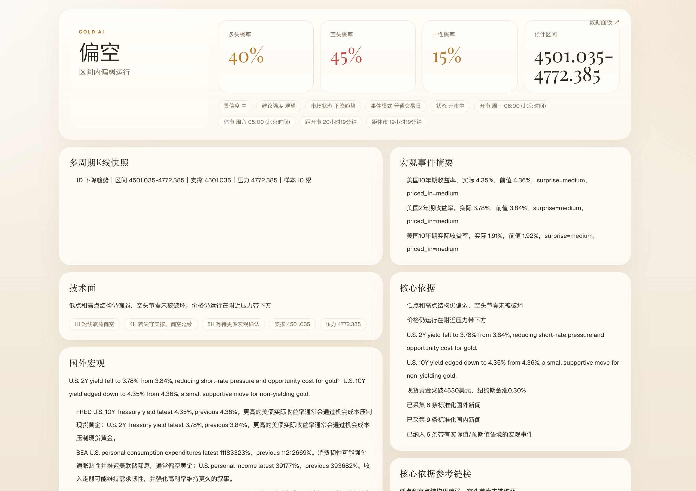
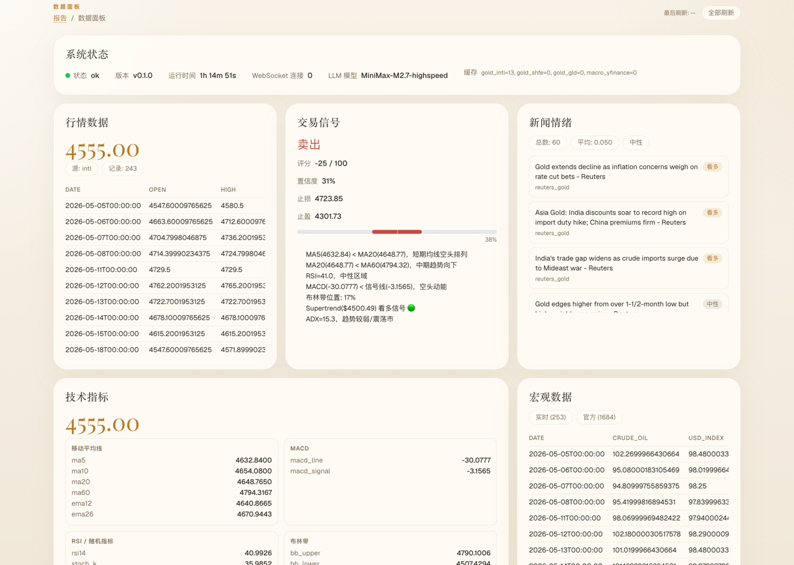

# 🥇 GoldAgent — 黄金价格分析 Agent

> 让数据说话，让 AI 辩论，让决策有据可依

量化 + LLM 混合驱动的黄金价格分析系统，具备数据采集、技术分析、时序预测、多 Agent 辩论和策略回测能力。

## ✨ 核心特性

- **📊 数据采集**: akshare (国内金价) + yfinance (国际金价) + FRED (宏观数据) + RSS (新闻情绪)
- **📈 技术指标**: 200+ 指标 (MA/RSI/MACD/布林带/ATR/ADX/Supertrend)
- **🔮 时序预测**: Prophet + 外部回归因子 (美元指数/美债/VIX)
- **🤖 多 Agent 辩论**: 看多方 vs 看空方 vs 数据审计员 → 仲裁官裁决
- **📉 策略回测**: backtrader 引擎, 内置策略, 完整绩效指标
- **🌐 REST API**: FastAPI, 自动文档, WebSocket 流式推送

---

## 🛠️ 技术栈详解

### 后端框架

| 技术 | 版本 | 用途 | 选型理由 |
|------|------|------|----------|
| **Python** | ≥ 3.12 | 主语言 | 最新语法特性 (match/case, type union) |
| **FastAPI** | ≥ 0.115 | Web 框架 | 异步高性能, 自动 OpenAPI 文档, 原生 WebSocket |
| **Uvicorn** | ≥ 0.34 | ASGI 服务器 | 标准异步服务器, 支持热重载 |
| **Pydantic v2** | ≥ 2.10 | 数据校验 | Rust 内核, 比 v1 快 5-50 倍 |
| **Loguru** | ≥ 0.7 | 日志 | 比 logging 更优雅的 API, 自动轮转 |

### 数据采集层

| 技术 | 版本 | 数据源 | 覆盖范围 |
|------|------|--------|----------|
| **akshare** | ≥ 1.15 | 上海金交所 | Au99.99 现货金, 沪金期货 (SHFE) |
| **yfinance** | ≥ 0.2.50 | Yahoo Finance | XAUUSD (伦敦金), GLD ETF, 美元指数, VIX, 美债收益率 |
| **fredapi** | ≥ 0.5.2 | 美联储 FRED | CPI, 联邦基金利率, M2, TIPS 收益率 |
| **httpx** | ≥ 0.28 | RSS 新闻 | Google News, Reuters, Kitco 黄金新闻 |

**数据源清单:**

```
金价数据:
  ├── gold_xauusd    → yfinance (COMEX 黄金期货 GC=F)
  ├── gold_etf       → yfinance (SPDR Gold ETF GLD)
  └── gold_spot_cny  → akshare  (上海金交所 Au99.99)

宏观指标:
  ├── usd_index      → yfinance (美元指数 DX-Y.NYB)
  ├── us_10y         → yfinance (10年期美债 ^TNX)
  ├── vix            → yfinance (恐慌指数 ^VIX)
  ├── cpi            → FRED (CPIAUCSL)
  ├── fed_rate       → FRED (FEDFUNDS)
  └── tips_yield     → FRED (10年期 TIPS 实际利率)

新闻情绪:
  ├── Google News    → RSS ('gold price' 关键词)
  ├── Reuters        → RSS (reuters.com+gold)
  └── Kitco          → RSS (kitco.com/rss/gold.xml)
```

### 数据处理层

| 技术 | 版本 | 用途 | 选型理由 |
|------|------|------|----------|
| **Pandas** | ≥ 2.2 | DataFrame 处理 | 金融数据分析事实标准 |
| **NumPy** | ≥ 2.0 | 数值计算 | 向量化运算, 底层 C 加速 |
| **PyArrow** | ≥ 18.0 | Parquet 读写 | 列式存储, 压缩率高, 查询快 |

**缓存策略:**

```
请求 → Redis 热缓存 (TTL 5min)
         ↓ miss
       Parquet 本地缓存 (按年月分区)
         ↓ miss
       远程 API 拉取 → 写回 Redis + Parquet
```

### 量化分析层

| 技术 | 版本 | 用途 | 选型理由 |
|------|------|------|----------|
| **pandas-ta** | ≥ 0.4 | 技术指标 | 纯 Python, 200+ 指标, 无 C 依赖 |
| **Prophet** | ≥ 1.1.6 | 时序预测 | Facebook 出品, 自带季节性检测, 支持外部回归因子 |
| **backtrader** | ≥ 1.9.78 | 策略回测 | 成熟稳定, 文档完善, 支持多策略/多标的 |

**技术指标清单:**

```
趋势指标:                          振荡指标:
  ├── SMA (5/10/20/60)              ├── RSI (14)
  ├── EMA (12/26)                   ├── Stochastic (K/D)
  └── Supertrend (10, 3x)           └── MACD (12/26/9)

波动率:                            趋势强度:
  ├── Bollinger Bands (20, 2σ)      ├── ADX (14)
  └── ATR (14)                      └── Supertrend 方向

成交量:
  └── OBV (On-Balance Volume)
```

**信号生成规则:**

| 指标 | 看多得分 | 看空得分 | 最大分值 |
|------|----------|----------|----------|
| MA5 vs MA20 | +20 | -20 | ±20 |
| MA20 vs MA60 | +10 | -10 | ±10 |
| RSI(14) < 30 | +15 | — | ±15 |
| RSI(14) > 70 | — | -15 | ±15 |
| MACD 金叉 | +15 | — | ±15 |
| MACD 死叉 | — | -15 | ±15 |
| 布林下轨 | +10 | — | ±10 |
| 布林上轨 | — | -10 | ±10 |
| Supertrend 多 | +20 | — | ±20 |
| Supertrend 空 | — | -20 | ±20 |
| ADX > 25 | 方向加分 | 方向减分 | ±10 |

信号分类: ≥50 强烈看多, ≥20 看多, ≤-20 看空, ≤-50 强烈看空

### LLM 辩论层

| 技术 | 版本 | 用途 | 选型理由 |
|------|------|------|----------|
| **OpenAI SDK** | ≥ 1.60 | LLM 调用 | 兼容 OpenAI/Claude/Gemini/Grok 所有端点 |

**4 Agent 多角色辩论架构:**

```
用户提问 / 定时触发
        │
        ▼
┌─ Step 1: 数据采集 ─────────────────────┐
│  DataService 拉取最新金价 + 宏观 + 新闻  │
└──────────────┬─────────────────────────┘
               │
               ▼
┌─ Step 2: 量化信号 ─────────────────────┐
│  QuantService 计算指标 + 预测 + 信号     │
└──────────────┬─────────────────────────┘
               │
               ▼
┌─ Step 3: 辩论 Round 1 ─────────────────┐
│  🟢 看多方: 基于数据构建看多论点 (GPT-4.1)    │
│  🔴 看空方: 基于数据构建看空论点 (Claude)      │
└──────────────┬─────────────────────────┘
               │
               ▼
┌─ Step 4: 数据审计 ─────────────────────┐
│  🔍 审计员: 验证双方数据准确性 (GPT-4.1-mini) │
└──────────────┬─────────────────────────┘
               │
               ▼
┌─ Step 5: 仲裁裁决 ─────────────────────┐
│  ⚖️ 仲裁官: 综合所有输入输出最终判断 (GPT-4.1) │
└──────────────┬─────────────────────────┘
               │
               ▼
         结构化 JSON 输出
```

**每个 Agent 的输出都是结构化 JSON:**

```json
// 看多方输出示例
{
  "stance": "bullish",
  "confidence": 72,
  "arguments": [
    {"point": "RSI 未超买", "evidence": "RSI=58.3", "strength": "medium"},
    {"point": "美元走弱", "evidence": "DXY 102.3→101.8", "strength": "strong"}
  ],
  "price_target": {"low": 3220, "high": 3300, "currency": "USD/oz"},
  "key_risk": "美债收益率上行可能压制金价"
}

// 仲裁官输出示例
{
  "verdict": "bullish",
  "confidence": 65,
  "price_range": {"low": 3220, "high": 3300},
  "time_horizon": "1w",
  "key_reasons": ["技术面偏多", "央行持续购金", "地缘风险支撑"],
  "risk_warnings": ["美债收益率上行", "CPI 超预期"],
  "final_advice": "震荡偏多, 建议轻仓做多, 止损 3200"
}
```

### 数据库层

| 技术 | 版本 | 用途 | 选型理由 |
|------|------|------|----------|
| **SQLAlchemy** | ≥ 2.0 | ORM | Python ORM 标准, 异步支持 |
| **asyncpg** | ≥ 0.30 | PostgreSQL 驱动 | 比 psycopg2 快 3-5 倍 |
| **Alembic** | ≥ 1.14 | 数据库迁移 | SQLAlchemy 官方迁移工具 |
| **Redis** | ≥ 5.2 | 缓存 + 事件总线 | 内存数据库, pub/sub 支持 |
| **PostgreSQL** | 15 | 主数据库 | 时序数据 + JSON 支持 |

**数据表设计:**

```
gold_prices          — 金价历史数据 (按数据源分区)
technical_indicators — 技术指标快照
trade_signals        — 交易信号记录
predictions          — Prophet 预测结果
debate_results       — 多 Agent 辩论完整记录
backtest_results     — 回测绩效数据
macro_data           — 宏观经济指标
news_articles        — 新闻情绪数据
system_config        — 系统配置键值对
```

### 前端 (规划中)

| 技术 | 版本 | 用途 | 选型理由 |
|------|------|------|----------|
| **Next.js** | 15 | 前端框架 | App Router, RSC, 流式渲染 |
| **TypeScript** | 5.x | 类型安全 | 减少运行时错误 |
| **lightweight-charts** | — | K 线图 | TradingView 开源图表库, 轻量高性能 |
| **Tailwind CSS** | — | 样式 | 原子化 CSS, 开发效率高 |

### 界面预览

**首页 — AI 分析概览**



**数据面板 — 实时行情与技术指标**



### 部署

| 技术 | 用途 | 说明 |
|------|------|------|
| **Docker** | 容器化 | Python 3.12-slim 基础镜像 |
| **Docker Compose** | 编排 | 一键启动 App + PostgreSQL + Redis |
| **WebSocket** | 实时推送 | 金价/信号/新闻/辩论结果实时更新 |

---

## 🏗️ 系统架构

```
┌──────────────────────────────────────────────────────────────┐
│                        前端仪表盘                             │
│   金价走势 · 技术指标 · 预测区间 · 辩论结果 · 回测报告        │
│                    Next.js + lightweight-charts               │
└──────────────┬───────────────────────────────────┬───────────┘
               │ REST / WebSocket                  │
┌──────────────▼───────────────────────────────────▼───────────┐
│                     FastAPI 后端                              │
│                                                              │
│  ┌─────────────┐ ┌─────────────┐ ┌─────────────────────────┐ │
│  │  数据采集    │ │  量化分析    │ │    LLM 辩论引擎          │ │
│  │             │ │             │ │                          │ │
│  │ · akshare   │ │ · pandas-ta │ │ · 🟢 看多方 (GPT-4.1)    │ │
│  │ · yfinance  │ │ · Prophet   │ │ · 🔴 看空方 (Claude)     │ │
│  │ · FRED API  │ │ · backtrader│ │ · 🔍 审计员 (GPT-4.1m)   │ │
│  │ · RSS 新闻  │ │ · 信号生成  │ │ · ⚖️ 仲裁官 (GPT-4.1)   │ │
│  └──────┬──────┘ └──────┬──────┘ └────────────┬────────────┘ │
│         │               │                     │              │
│  ┌──────▼───────────────▼─────────────────────▼────────────┐ │
│  │                    共享数据层                              │ │
│  │   PostgreSQL + Redis + 本地 Parquet 缓存             │ │
│  └──────────────────────────────────────────────────────────┘ │
└──────────────────────────────────────────────────────────────┘
```

---

## 🚀 快速开始

### 方式一: 本地运行

```bash
# 1. 克隆项目
git clone https://github.com/abracadabbra/gold-agent.git
cd gold-agent

# 2. 安装依赖
pip install -e ".[dev]"

# 3. 配置环境变量
cp .env.example .env
# 编辑 .env 填入 API Key

# 4. 启动服务
uvicorn gold_agent.main:app --reload --host 0.0.0.0 --port 8000

# 5. 访问 API 文档
open http://localhost:8000/docs
```

### 方式二: Docker Compose

```bash
# 1. 配置环境变量
cp .env.example .env
# 编辑 .env 填入 API Key

# 2. 一键启动
docker-compose up -d

# 3. 查看日志
docker-compose logs -f app
```

---

## 📡 API 接口

| 接口 | 方法 | 说明 |
|------|------|------|
| `/api/analysis/gold` | GET | 获取金价数据 (支持 intl/shfe/gld) |
| `/api/analysis/indicators` | GET | 技术指标计算 (MA/RSI/MACD/BB/ATR/ADX) |
| `/api/analysis/signal` | GET | 交易信号生成 (综合评分 -100~+100) |
| `/api/analysis/predict` | GET | Prophet 时序预测 (1-30天) |
| `/api/analysis/macro` | GET | 宏观数据 (美元指数/美债/VIX) |
| `/api/analysis/news` | GET | 新闻情绪分析 (RSS + 关键词) |
| `/api/debate/run` | POST | 运行完整 4 Agent 辩论 |
| `/api/debate/quick` | GET | 快速分析 (不走辩论) |
| `/api/backtest/run` | GET | 运行策略回测 |
| `/api/backtest/strategies` | GET | 列出可用策略 |
| `/ws/{client_id}` | WS | WebSocket 实时推送 |
| `/health` | GET | 健康检查 + 系统状态 |
| `/stats` | GET | 系统统计信息 |

### WebSocket 订阅

```javascript
const ws = new WebSocket('ws://localhost:8000/ws/my-client-id');

// 订阅金价更新
ws.send(JSON.stringify({type: 'subscribe', channel: 'price'}));

// 订阅信号更新
ws.send(JSON.stringify({type: 'subscribe', channel: 'signal'}));

// 订阅辩论结果
ws.send(JSON.stringify({type: 'subscribe', channel: 'debate'}));

// 接收消息
ws.onmessage = (event) => {
  const data = JSON.parse(event.data);
  console.log(data);
};
```

---

## 🤖 多 Agent 辩论

| Agent | 角色 | 模型 | 温度 | 职责 |
|-------|------|------|------|------|
| 🟢 看多方 | Bull Advocate | GPT-4.1 | 0.7 | 构建看多论点, 引用数据支撑 |
| 🔴 看空方 | Bear Challenger | Claude Sonnet 4 | 0.7 | 质疑反驳, 寻找反面证据 |
| 🔍 审计员 | Data Auditor | GPT-4.1-mini | 0.2 | 验证数据准确性, 标记幻觉 |
| ⚖️ 仲裁官 | Chief Arbitrator | GPT-4.1 | 0.4 | 综合裁决, 输出趋势判断 |

**辩论成本:** 单次约 $0.02-0.05 (4 次 LLM 调用)

---

## 📈 内置回测策略

- **Golden Cross**: MA20/MA60 金叉死叉 + RSI 过滤 + ATR 止损
- **RSI Mean Reversion**: RSI < 30 超卖买入, RSI > 70 超买卖出
- **MACD Crossover**: MACD 金叉 + 柱状图放大确认

**回测指标:** Sharpe Ratio / 最大回撤 / 胜率 / 总交易次数 / 资金曲线

---

## 📁 项目结构

```
gold-agent/
├── src/gold_agent/
│   ├── config.py              # Pydantic Settings 配置管理
│   ├── main.py                # FastAPI 入口 + 生命周期
│   │
│   ├── data/                  # 数据采集层
│   │   ├── gold_price.py      # 金价数据 (akshare + yfinance)
│   │   ├── macro.py           # 宏观数据 (FRED + yfinance)
│   │   ├── news.py            # 新闻情绪 (RSS + 关键词)
│   │   └── cache.py           # 两级缓存 (Redis + Parquet)
│   │
│   ├── quant/                 # 量化分析层
│   │   ├── indicators.py      # 技术指标 (pandas-ta + 纯 pandas 回退)
│   │   ├── predictor.py       # Prophet 时序预测
│   │   ├── signals.py         # 多指标信号生成
│   │   └── backtest/
│   │       └── engine.py      # backtrader 回测引擎封装
│   │
│   ├── debate/                # LLM 辩论层
│   │   ├── agents.py          # 4 Agent 配置
│   │   ├── engine.py          # 辩论流程编排
│   │   ├── llm.py             # OpenAI 兼容调用封装
│   │   └── prompts.py         # 提示词模板
│   │
│   ├── api/                   # API 路由
│   │   ├── analysis.py        # 分析接口 (金价/指标/信号/预测)
│   │   ├── debate.py          # 辩论接口
│   │   ├── backtest.py        # 回测接口
│   │   └── websocket.py       # WebSocket 实时推送
│   │
│   └── db/
│       └── models.py          # SQLAlchemy 9 张表模型
│
├── tests/                     # pytest 单元测试
├── frontend/                  # Next.js 前端 (规划中)
├── Dockerfile                 # 容器镜像
├── docker-compose.yml         # 编排配置
├── pyproject.toml             # 项目元数据 + 依赖
└── .env.example               # 环境变量模板
```

---

## 📄 License

MIT
